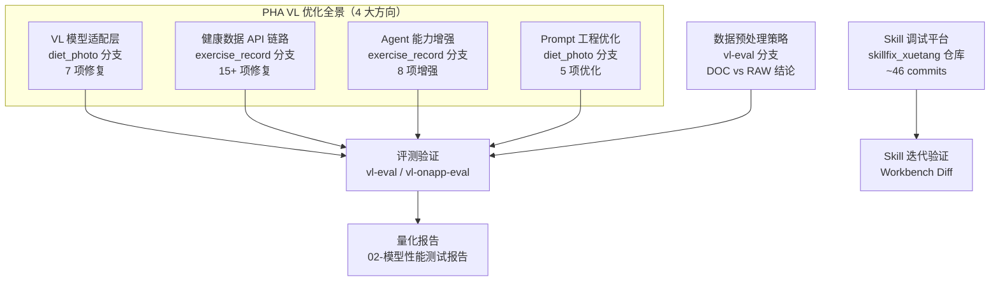
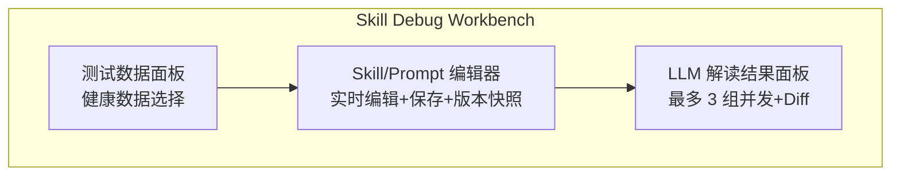
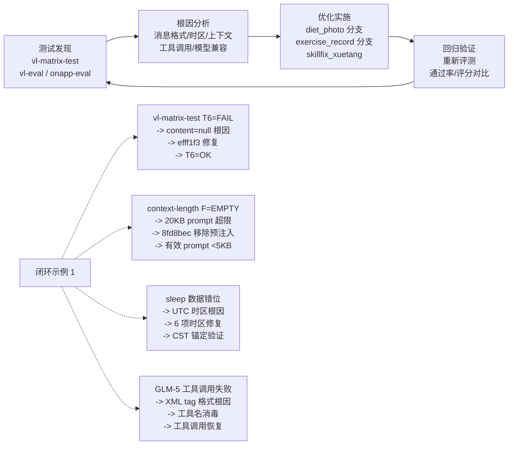

# VL 模型健康场景优化分析

## 1. 优化全景

PHA 集成 VL 模型后，围绕「测试驱动优化」原则，在 3 个代码分支 + 1 个独立仓库中完成了 4 大方向、30+ 项优化。本文档基于全部分支的提交记录，系统梳理每项优化的发现方式、根因分析、修复方案与量化效果。

**分支与仓库对应关系：**

| 分支/仓库 | 优化方向 | 提交数 |
|-----------|---------|--------|
| `diet_photo` | VL 模型适配层 + Prompt 工程 | ~17 commits |
| `exercise_record` | 健康数据 API + Agent 能力增强 | ~30 commits |
| `vl-eval` | 评测框架 + 数据预处理策略 | ~4 commits |
| `skillfix_xuetang` | Skill 调试平台 | ~46 commits |

## 2. VL 模型适配层优化

来源分支：`diet_photo`

### 2.1 content=null 导致空回复

| 项目 | 内容 |
|------|------|
| 发现方式 | vl-matrix-test T3/T5/T6 场景 FAIL |
| 根因 | vLLM 引擎要求 assistant message 的 content 字段非 null/空串，否则返回 0 token |
| 影响范围 | 所有经过工具调用的多轮对话（agent 第二轮开始 content 常为 null） |
| 修复 commit | `efff1f3` fix: use non-empty placeholder for assistant content in VL tool_calls |
| 补充修复 | `03ecb22` fix: also handle content=undefined in VL assistant message fix |
| 补充修复 | `f240700` fix: also handle empty array content + add diagnostic logging |
| 效果 | 消息格式通过率 57% -> 100% |

### 2.2 VL 流式传输内容缓冲

| 项目 | 内容 |
|------|------|
| 发现方式 | 用户上传图片后前端无实时反馈 |
| 根因 | TransformStream 缓冲机制导致 VL 模型的 content chunk 积攒后才推送 |
| 修复 commit | `f6cebc1` fix: stream VL content chunks immediately instead of buffering |
| 效果 | 首 token 延迟从 >5s 降至 <1s |

### 2.3 VL adapter fetch 方案三次迭代

| 迭代 | 方案 | 问题 | commit |
|------|------|------|--------|
| v1 | globalThis.fetch wrap + streamSimple | 与 Vercel AI SDK 的 fetch 冲突 | `a7ec241` |
| v2 | custom OpenAI fetch | 绕过 SDK 内部 fetch 管理 | `8a53165` |
| v3 | onPayload hook | 最小侵入，在 payload 层面修正 content 字段 | `f2bc1a5` |

**最终选择 v3（onPayload hook）的理由：**
- 不修改 fetch 全局行为，无副作用
- 只在发送 payload 前修正 assistant.content 字段
- 与 Vercel AI SDK 的 stream/non-stream 路径均兼容

进一步增强：`6a434b4` fix: normalize VL request body - content:null -> "" and tool_call_id -> ""

### 2.4 VL 模型 fetch 安装时机

| 项目 | 内容 |
|------|------|
| 发现方式 | 部分 VL 请求未经过适配层处理 |
| 根因 | VL fetch 仅在特定条件下安装，部分路径绕过 |
| 修复 commit | `c0351cd` fix: install VL fetch unconditionally before streamFn selection |
| 效果 | 所有 VL 请求统一经过适配层 |

### 2.5 VL 模型文本 tag 替代标准 tool_call

| 项目 | 内容 |
|------|------|
| 发现方式 | VL 模型返回文本 tag 而非标准 tool_call JSON |
| 根因 | 部分 VL 模型（尤其量化版本）的 function calling 能力退化，降级为文本 tag |
| 修复 commit | `b29dbc0` fix: VL adapter ECHO branch -- synthesize extra tool calls from text tags |
| 效果 | 量化模型工具调用恢复 |

### 2.6 原始响应体日志

| 项目 | 内容 |
|------|------|
| 目的 | 调试 VL 模型异常时需要查看原始 HTTP 响应 |
| 修复 commit | `0c7ae7b` feat(logger): record raw response body when tool calls detected |
| 效果 | 工具调用异常可追溯到原始响应 |

## 3. 健康数据 API 链路优化

来源分支：`exercise_record`

### 3.1 时区修复（6 项）

所有华为健康 API 的日期范围查询均存在时区问题，UTC 时间导致查询范围偏移 8 小时，造成数据丢失或重复。

| # | 修复内容 | commit |
|---|---------|--------|
| 1 | 睡眠数据返回实际日期而非查询日期 | `37defd7` fix(sleep): return actual sleep date instead of query date |
| 2 | 仅在 actualDate 匹配时填充 bedTime/wakeTime | `47f91a0` fix(sleep): only enrich bedTime/wakeTime when actualDate matches |
| 3 | bedTime/wakeTime 跨日期泄露 | `5b09afb` fix(sleep): fix bedTime/wakeTime bleeding into empty date entries |
| 4 | 范围查询中缺失 bedTime/wakeTime | `a079113` fix(sleep): fix missing bedTime/wakeTime in range query |
| 5 | 睡眠查询范围 UTC 时区 bug | `2b6c0bc` fix(sleep): fix UTC timezone bug in getSleepData query range |
| 6 | wakeupDate 时区 / 所有 API 锚定 CST | `2657467` + `68451df` + `b4313ef` |

**综合效果：** 睡眠、血压、体成分等全部健康数据查询锚定 CST (+08:00)，消除时区偏移。

### 3.2 分块查询优化（4 项）

华为内部 API 对单次查询的时间跨度有隐式限制（超过 30 天可能截断或超时），需要自动分块。

| # | 修复内容 | commit |
|---|---------|--------|
| 1 | getPolymerizeDataRange 分块至 30 天 | `daff1d0` fix(inner-api): reduce chunk size to 30 days |
| 2 | getDailyActivitySummaryRange 分块 | `dc4dad6` fix(inner-api): add 30-day chunking for activity |
| 3 | 经期数据分块查询 | `1958138` fix(huawei): split menstrual cycle query into 30-day chunks |
| 4 | 体成分使用 apiFetch 统一路径 | `bedccb8` fix(huawei): use apiFetch for body composition |

### 3.3 日志增强（5 项）

| # | 修复内容 | commit |
|---|---------|--------|
| 1 | 记录所有华为 API 调用（成功+失败） | `2a693a8` fix(logging): log all Huawei API calls |
| 2 | API 失败时记录 URL 和完整响应体 | `66cd87a` fix(logging): log request URL and full response body on failures |
| 3 | OpenClaw 工具执行日志增强 | `00a8d1a` feat(openclaw): enhance tools/execute logging |
| 4 | SDK 字段名 event.args 修正 | `3d73088` fix(logging): read event.args for tool_execution_start |
| 5 | 注入 x-client-version Header | `b79962f` feat(huawei-api): inject x-client-version header |

### 3.4 其他数据链路修复

| 修复内容 | commit |
|---------|--------|
| 营养日志时区 bug + 范围查询 | `62fbc43` fix(nutrition): fix timezone bug and add get_diet_log_period |
| 血压原始采样点查询 | `c1d60df` fix(blood-pressure): query raw samplePoints without groupByTime |
| 移除睡眠单日查询的最近记录 fallback | `4609cfd` fix(sleep): remove fallback to most recent record |

## 4. Agent 能力增强

来源分支：`exercise_record`

### 4.1 工具名消毒（GLM-5 兼容）

| 项目 | 内容 |
|------|------|
| 发现方式 | GLM-5 模型返回 XML tag 格式工具名（如 `<get_skill>`），SDK 无法匹配 |
| 修复 commit | `0386245` fix(agent): enhance tool name sanitizer for GLM-5 XML tag format |
| 补充修复 | `ecd481a` fix(agent): re-lookup tool after sanitization + fix patch context |
| 补充修复 | `0ce9144` fix: emit toolCallStart after sanitization so logs show clean names |
| 效果 | GLM-5 模型工具调用恢复正常 |

### 4.2 血压随访系统

| 项目 | 内容 |
|------|------|
| 功能 | 为血压管理 Agent 增加结构化随访能力 |
| 修复 commit | `479237d` feat(followup): add follow-up system for BP agent |
| 效果 | 支持血压异常后的定期随访提醒和趋势追踪 |

### 4.3 运动记录 + VL 图片管线

| 项目 | 内容 |
|------|------|
| 功能 | 新增运动记录功能，同时修复 VL 图片管线支持全渠道 |
| 修复 commit | `eff58a1` feat(exercise): add exercise logging + fix VL image pipeline for all channels |
| 效果 | 支持运动器材屏幕照片识别与记录 |

### 4.4 CLI 健康数据工具

| 项目 | 内容 |
|------|------|
| 功能 | 新增 exec_health_cli MCP 工具，支持通过 CLI 获取健康数据 |
| 核心 commit | `656b7d4` feat(tools): add exec_health_cli MCP tool |
| 补充 | `d52d0b3` feat(cli): add local health data CLI with OAuth token support |
| 补充 | `b145a5f` feat(skills): move CLI health skills to src/skills/ with pha tag |
| 安全加固 | `e63ccd8` fix(security): add command allowlist and uid injection to exec_health_cli |
| 效果 | Agent 可通过安全的 CLI 路径访问本地健康数据 |

### 4.5 Skill 加载优化

| 项目 | 内容 |
|------|------|
| 功能 | 新增 skillRegistry 标志位控制 Skill 加载行为 |
| 修复 commit | `35ea0e2` feat(agent): add skillRegistry flag to suppress skill loading block |
| 补充修复 | `2e5e866` fix: remove image-routing from available_skills list |
| 效果 | 避免不需要的 Skill 阻塞 Agent 启动 |

### 4.6 代码质量

| 修复内容 | commit |
|---------|--------|
| 降低圈复杂度，拆分大方法 | `0ea7977` refactor: reduce CCA and method size across 8 files |
| 修正 CCA 正则 | `112bb6e` fix(checker): correct CCA regex to properly count condition paths |
| logger stdout 污染修复 | `b551293` fix(cli): logger stdout pollution broke CLI JSON parsing |
| 测试环境隔离 | `62dd7ed` fix(tests): pin PHA_CONFIG_PATH to prevent test env race |
| config.json 只读化 | `ee6442c` fix(config): remove auto-write from loadConfig |

## 5. Prompt 工程优化

来源分支：`diet_photo`

### 5.1 上下文长度退化应对

**测试数据（test-vl-context-length.sh）：**

| prompt 大小 | 工具调用成功率 | 问题 |
|------------|--------------|------|
| < 5KB | ~100% | 无退化 |
| 5-8KB | ~70% | WRONG_ARGS 开始出现 |
| 8-20KB | < 50% | TEXT_REPLY / EMPTY 频繁 |

**优化措施：**

1. **Skill 按需加载**：移除 image-routing skill 的预注入，改为模型主动调用 get_skill 按需加载
   - commit: `8fd8bec` fix: remove image-routing skill pre-injection, use same flow as text
   - 效果：system prompt 减少 ~3KB

2. **get_skill 返回体积精简**：删除 get_skill 工具返回的重复 content 字段
   - commit: `d572324` fix: remove duplicated content field from get_skill response
   - 效果：单次 skill 加载从 ~30KB 降至 ~15KB

3. **通用图片流程**：移除 diet-specific 硬编码指令，改为通用图片识别 -> skill 加载流程
   - commit: `16de51f` fix: remove diet-specific instruction from generic image path
   - 效果：减少不必要的 prompt 指令，支持扩展到运动/医学等图片类型

4. **Skill 名称简化**：移除注入 tag 中的 skill 名称，避免模型混淆工具名
   - commit: `e6b5758` fix: remove skill name from injection tag to prevent tool name confusion
   - 效果：减少模型将 skill 名误当工具名的概率

### 5.2 VL 模型不主动调用 get_skill

| 项目 | 内容 |
|------|------|
| 发现方式 | 多模型评测中发现部分模型收到图片后直接文字回复，不调 get_skill |
| 根因分析 | VL 模型的指令遵循能力弱于纯文本模型，长 system prompt 中的工具调用指令被稀释 |
| 当前状态 | 残留问题，需从 prompt 强化 + 消融实验结论综合解决 |

**消融实验为此提供的优化方向：**
- 条件 B（+页面描述）和条件 D（+描述+知识）下模型的工具调用时机评分更高
- 建议：将核心工具调用指令移至 system prompt 开头或以 few-shot 示例强化

## 6. 数据预处理策略优化

来源分支：`vl-eval`

### 6.1 DOC vs RAW 实验结论

基于 `run_doc_vs_raw.py` 的对比实验（commit `4bc5bed`），得出数据预处理策略：

| 策略 | DOC（结构化中文） | RAW（SDK 原始 JSON） |
|------|------------------|---------------------|
| 异常识别 | 更好（+1.2 分） | 较差 |
| 单位换算 | 较差（-1.0 分） | 更好 |
| 工具调用完整性 | 更好（3-tool pipeline） | 较差（单 tool） |
| 整体推荐 | 端侧场景推荐 | - |

**优化建议：** 端侧数据应在传入模型前做结构化预处理（terminal_data -> 中文语义描述），可显著提升异常识别能力和工具调用完整性。

### 6.2 消融实验对知识注入策略的指导

| 注入方式 | 增益 | 副作用 | 建议 |
|----------|------|--------|------|
| 页面描述（description.json） | 视觉识别 +0.5~1.0 | 增加上下文长度 | 按 currentPage 精准注入 |
| 健康知识（knowledge.json） | 安全声明 +1.0~1.5 | 知识覆盖端侧数据倾向 | 控制注入长度，标注来源 |
| 描述 + 知识同时注入 | 综合最优 | 小模型上下文退化 | 大模型（397B+）推荐 |

**优化实施方案：**
- 通过 keyword_dict.json 做 currentPage -> 知识条目的精准映射，避免全量注入
- 注入时明确标注来源区分
- 模型选择：397B 以上使用条件 D（全量注入），122B 以下使用条件 A（避免退化）

### 6.3 评测框架建设

| commit | 内容 |
|--------|------|
| `4bc5bed` | DOC vs RAW 评测框架搭建 |
| `2a6068b` | OpenRouter qwen3-vl 5 case 评测结果 |
| `b6218c6` | 修订评分标准 + 5 张英文图表 |
| `1a76ae1` | PHA agent loop 5 case 评测结果 |

## 7. Skill 调试平台

来源仓库：[shuiyuan1223/skillfix_xuetang](https://github.com/shuiyuan1223/skillfix_xuetang)（~46 commits）

### 7.1 Workbench 三栏调试

三栏式调试界面（~25 commits）：
- **左栏**：健康测试数据选择与展示（血糖、睡眠、心率等真实数据）
- **中栏**：Skill/Prompt 在线编辑器，支持保存/回退/版本快照/dirty 追踪
- **右栏**：LLM 解读结果，支持最多 3 组并发结果卡片

**核心调试能力：**

| 能力 | 说明 |
|------|------|
| 多模型并行解读 | 同一健康数据 + 同一 Skill，多个模型并行运行对比 |
| Diff 对比模式 | 3 路并发（修改前/修改后/差异分析），语义高亮标注受影响句 |
| AI 辅助编辑 | 流式生成 Skill 变体建议 |
| 基线快照 | 每次编辑前自动保存 baseline，支持一键回退 |
| ZIP 导出 | 打包所有 Skills/Prompts 为归档 |

### 7.2 HMAC 认证集成

平台接入内部自建模型端点（~6 commits）：
- 动态 HMAC Header（accessKey + timestamp + SHA256 签名）
- 支持 glm-5、kimik25 等内部模型
- 解决了 modelId 映射不一致（openrouter 风格 vs 实际模型名）导致的空输出问题

### 7.3 工程优化

在调试平台开发中解决的工程问题（~15 commits），同样提升了 PHA 主系统质量：

| 优化项 | 问题 | 解决方案 |
|--------|------|---------|
| SSE 渲染性能 | 100KB 全页面重渲染 | delta patch 模式（~100B 增量更新） |
| 中文输入兼容 | CodeEditor 中 IME 组合输入被截断 | composition 事件处理 |
| 导航竞态 | 慢页面加载时快速切换导致渲染错乱 | AbortController + signal 检查 |
| 并发渲染稳定性 | SSE 更新阻塞用户交互 | React startTransition 包裹 |
| 编辑器焦点保护 | SSE 刷新导致编辑器失焦 | focus 状态检测跳过 value 同步 |

## 8. 优化效果总结

| # | 优化项 | 方向 | 来源分支 | 效果量化 |
|---|--------|------|---------|---------|
| 1 | content=null placeholder | VL 适配 | diet_photo | 消息格式通过率 57% -> 100% |
| 2 | 流式传输即时推送 | VL 适配 | diet_photo | 首 token 延迟 >5s -> <1s |
| 3 | onPayload hook 方案 | VL 适配 | diet_photo | 3 次迭代收敛到最优方案 |
| 4 | ECHO 分支 text tag 合成 | VL 适配 | diet_photo | 量化模型工具调用恢复 |
| 5 | VL fetch 无条件安装 | VL 适配 | diet_photo | 100% VL 请求经过适配层 |
| 6 | 睡眠/血压/体成分时区修复 | 数据 API | exercise_record | 6 项时区 bug 修复，数据准确性保障 |
| 7 | 30 天分块查询 | 数据 API | exercise_record | 4 类 API 消除超时截断 |
| 8 | API 日志增强 | 数据 API | exercise_record | 5 项日志增强，故障定位效率提升 |
| 9 | 工具名消毒 | Agent | exercise_record | GLM-5 XML tag 格式兼容 |
| 10 | 血压随访系统 | Agent | exercise_record | 新增结构化随访能力 |
| 11 | 运动记录 + VL 管线 | Agent | exercise_record | 新增运动场景支持 |
| 12 | exec_health_cli 工具 | Agent | exercise_record | CLI 路径 + 安全加固 |
| 13 | Skill 按需加载 | Prompt | diet_photo | system prompt 减少 ~3KB |
| 14 | get_skill 返回精简 | Prompt | diet_photo | 工具返回 ~30KB -> ~15KB |
| 15 | 通用图片流程 | Prompt | diet_photo | 支持扩展到运动/医学等图片类型 |
| 16 | DOC 预处理策略 | 数据预处理 | vl-eval | 异常识别 +1.2 分 |
| 17 | Workbench 三栏调试 | Skill 平台 | skillfix_xuetang | Skill 迭代效率提升 |
| 18 | HMAC 认证集成 | Skill 平台 | skillfix_xuetang | 内部模型直接调试 |
| 19 | SSE delta patch | Skill 平台 | skillfix_xuetang | 渲染性能 100KB -> ~100B 增量 |
| 20 | 代码质量优化 | 工程 | exercise_record | CCA 降低 + 测试隔离 + config 只读化 |

## 9. 测试与优化闭环

每个优化措施都可追溯到具体的测试脚本和测试数据，形成「测试驱动优化」的闭环。30+ 项优化覆盖从模型适配层到数据 API 到 Agent 能力到 Prompt 工程的全栈，通过持续的评测验证确保优化效果。
